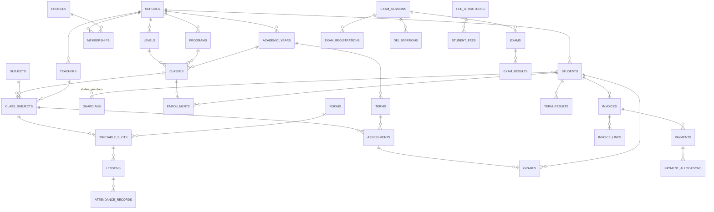

# Schéma de base de données

> 8 domaines, ~55 tables. Toutes les tables métier portent `school_id uuid not null references schools(id) on delete cascade`, `created_at`, `updated_at`, et un index `(school_id, …)`.
> Clés primaires : `uuid default gen_random_uuid()`.
> Suppressions : `deleted_at` (soft delete) sur les entités référencées historiquement (élèves, enseignants, classes) ; cascade réelle ailleurs.

---

## Vue d'ensemble



---

## 1. Socle multi-établissement

**`schools`** — `id, name, slug (unique), type (school_type), email, phone, address, city, country, logo_url, timezone, locale, currency, settings jsonb, is_active`

`settings` porte le paramétrage variable :

```jsonc
{
  "grading": {
    "mode": "weighted_average",   // "weighted_average" (/20 pondéré) | "ects" (crédits)
    "scale": 20,                  // barème de référence
    "passing_score": 10,
    "compensation": true,         // mode ects: compensation intra-semestre
    "compensation_floor": 7       // note plancher sous laquelle pas de compensation
  },
  "terms_per_year": 3,
  "week_days": [1,2,3,4,5],
  "day_start": "08:00", "day_end": "18:00",
  "matricule_prefix": "LYC",
  "vocabulary": { "class": "Classe", "term": "Trimestre", "subject": "Matière" }
}
```

**`grading.mode` est l'axe de bascule du module Notes.** Les deux modes partagent la même chaîne de saisie (`assessments` → `grades` → moyenne par matière) ; ils divergent uniquement à l'agrégation et à la restitution.

**`academic_years`** — `id, school_id, name ('2025-2026'), start_date, end_date, is_current, is_closed`
→ *unique* `(school_id, name)` ; *partial unique* sur `is_current` (une seule année courante par école).

**`terms`** — `id, school_id, academic_year_id, name, kind (trimester|semester|quarter), sequence, start_date, end_date, is_current, is_locked`
`is_locked` gèle la saisie de notes après publication des bulletins.

**`school_calendar`** — `id, school_id, academic_year_id, name, type (holiday|exam_period|closure|event), start_date, end_date`
Exclut les jours fériés de la génération des séances et du calcul d'assiduité.

## 2. Identité, rôles

**`profiles`** — `id (= auth.users.id), first_name, last_name, avatar_url, phone, locale, is_platform_admin`
Créée par trigger `on auth.users insert`.

**`memberships`** — `id, school_id, user_id → profiles, role (user_role), is_active, invited_by, joined_at`
*unique* `(school_id, user_id, role)`. **Pivot central de la tenancy.**

`user_role` = `super_admin | school_admin | teacher | student | parent | accountant`

**`teachers`** — `id, school_id, profile_id (nullable), employee_no, first_name, last_name, email, phone, birth_date, gender, hire_date, contract_type, speciality, photo_url, status (active|on_leave|left), deleted_at`
`profile_id` nullable : un enseignant peut exister au planning avant d'avoir un compte.

## 3. Élèves & familles

**`students`** — `id, school_id, profile_id (nullable), matricule, first_name, last_name, birth_date, birth_place, gender, nationality, photo_url, email, phone, address, city, blood_group, medical_notes, entry_date, exit_date, status (enrolled|graduated|transferred|withdrawn|suspended), deleted_at`
*unique* `(school_id, matricule)` — généré par `next_number(school_id,'matricule')`.

**`guardians`** — `id, school_id, profile_id (nullable), first_name, last_name, email, phone, address, profession, national_id`

**`student_guardians`** — `student_id, guardian_id, relationship (father|mother|tutor|other), is_primary, is_legal_guardian, receives_invoices, can_pick_up`
*PK composite*. Alimente `private.my_student_ids()` pour l'accès parent.

**`student_documents`** — `id, school_id, student_id, type, label, storage_path, uploaded_by, uploaded_at`

**`import_jobs`** — `id, school_id, entity (students|teachers|grades), filename, storage_path, status, total_rows, success_rows, error_rows, errors jsonb, created_by`

## 4. Structure académique

**`levels`** — `id, school_id, name ('6ème', 'L1'), code, cycle (preschool|primary|middle|high|higher), order_index`
**`programs`** — `id, school_id, name ('Série S', 'Génie Logiciel'), code, level_id (nullable), head_teacher_id` — filières/départements.
**`subjects`** — `id, school_id, name, code, category, is_active`
**`subject_levels`** — `subject_id, level_id, default_coefficient, default_max_score, default_weekly_hours` — *modèle* réutilisé à la création d'une classe.
**`rooms`** — `id, school_id, name, code, building, floor, capacity, type (classroom|lab|amphitheater|gym|library), is_active`

**`classes`** — `id, school_id, academic_year_id, level_id, program_id (nullable), name ('6ème A'), code, capacity, main_teacher_id → teachers, default_room_id → rooms`
*unique* `(school_id, academic_year_id, name)`

**`class_subjects`** — `id, school_id, class_id, subject_id, teacher_id, coefficient numeric(4,2), credits numeric(4,1) (mode ECTS), max_score numeric(5,2) default 20, weekly_hours numeric(4,1), is_optional`
*unique* `(class_id, subject_id)`. **C'est ici que vivent les coefficients (et les crédits) effectifs.**

### Unités d'enseignement — mode ECTS uniquement

**`study_units`** — `id, school_id, academic_year_id, term_id, level_id, program_id, code ('UE-INFO-301'), name, credits numeric(4,1), kind (fundamental|methodology|discovery|transversal), is_compulsory`
**`study_unit_subjects`** — `study_unit_id, class_subject_id, weight` — rattache les ECUE (matières) à leur UE.
*PK composite.* Une matière appartient à au plus une UE par période.

En mode `weighted_average`, ces deux tables restent simplement vides : aucune branche conditionnelle dans le reste du schéma.

**`enrollments`** — `id, school_id, student_id, class_id, academic_year_id, enrolled_at, status (active|transferred|withdrawn|repeating|completed), is_repeating, previous_school, withdrawal_reason, withdrawn_at`
*unique partiel* `(student_id, academic_year_id) where status = 'active'` — un élève, une classe active par année. La table **est** l'historique scolaire.

## 5. Emplois du temps

**`timetable_slots`** — `id, school_id, academic_year_id, term_id (nullable), class_subject_id, teacher_id, room_id, day_of_week (1-7), start_time, end_time, valid_from, valid_to, color`

Détection de conflits **au niveau Postgres** (`btree_gist` + type `timerange` custom), pas en JS :

```sql
create type timerange as range (subtype = time);

-- une salle ne peut accueillir deux cours au même moment
alter table timetable_slots add constraint no_room_overlap
  exclude using gist (
    room_id with =, day_of_week with =, academic_year_id with =,
    timerange(start_time, end_time) with &&
  ) where (room_id is not null);

-- idem pour l'enseignant, et pour la classe
```

Le drag & drop applique une mise à jour optimiste ; une violation `23P01` remonte en message clair (« M. Diallo a déjà cours en salle B12 à cette heure »).

**`lessons`** — `id, school_id, timetable_slot_id (nullable), class_id, subject_id, teacher_id, room_id, date, start_time, end_time, status (planned|held|cancelled|replaced), topic, homework, substitute_teacher_id`
Instance datée d'un créneau, générée par `generate_lessons(class_id, from, to)` en excluant `school_calendar`. Support des cours exceptionnels, annulations, rattrapages — et **support obligatoire de la présence**.

## 6. Notes & bulletins

**`assessment_types`** — `id, school_id, name ('Devoir surveillé'), code, default_weight`
**`assessments`** — `id, school_id, class_subject_id, term_id, assessment_type_id, title, description, date, max_score, weight numeric(4,2), is_published, created_by`
**`grades`** — `id, school_id, assessment_id, student_id, score numeric(5,2) null, is_absent, is_excused, comment, graded_by, graded_at`
*unique* `(assessment_id, student_id)`. `score` nullable = non saisi ; `is_absent` distingue absence de zéro.

### Règles de calcul (fonctions SQL, jamais en JS)

**Socle commun aux deux modes** — moyenne d'une matière sur une période :

```
moyenne_matière = Σ(score / max_score × scale × weight) / Σ(weight)   -- absence non excusée = 0
```

**Mode `weighted_average` (/20)**

```
moyenne_générale = Σ(moyenne_matière × coefficient) / Σ(coefficients)
rang             = rank() over (partition by class_id, term_id order by moyenne_générale desc)
décision         = moyenne_générale >= passing_score
```

**Mode `ects`**

```
moyenne_UE     = Σ(moyenne_matière × weight) / Σ(weight)              -- au sein de study_unit_subjects
UE validée     ⟺ moyenne_UE >= passing_score                          -- validation directe
                 OU (compensation ET moyenne_semestre >= passing_score
                     ET moyenne_UE >= compensation_floor)             -- validation par compensation
crédits_acquis = Σ(study_units.credits) sur les UE validées
moyenne_semestre = Σ(moyenne_UE × credits) / Σ(credits)
```

Une seule fonction `compute_term_results(class_id, term_id)` lit `schools.settings->'grading'->>'mode'` et applique la branche correspondante. Le frontend n'en sait rien : il consomme les mêmes vues.

**`v_subject_averages`** / **`v_unit_averages`** / **`v_term_averages`** — vues *live* (tableau de bord, saisie en cours).
**`term_subject_results`** — `id, school_id, student_id, class_subject_id, term_id, average, rank, class_average, class_min, class_max, teacher_comment` — **snapshot figé** à la publication.
**`term_unit_results`** *(mode ECTS)* — `id, school_id, student_id, study_unit_id, term_id, average, credits, credits_earned, is_validated, validation_mode (direct|compensation|resit)`
**`term_results`** — `id, school_id, student_id, class_id, term_id, general_average, rank, class_size, class_average, credits_earned, credits_required, decision, head_comment, absences_count, late_count, is_published, published_at, published_by, pdf_path`

Le gabarit PDF suit le mode : **bulletin** (matières, coefficients, moyennes, rang, appréciations) ou **relevé semestriel** (UE, ECUE, crédits acquis/tentés, mention).

La séparation vue live / snapshot est volontaire : un bulletin PDF déjà remis ne doit jamais changer si un coefficient est corrigé six mois plus tard.

## 7. Examens

**`exam_sessions`** — `id, school_id, academic_year_id, term_id, name ('Session de juin'), type (regular|resit|entrance|final), start_date, end_date, status (draft|scheduled|ongoing|graded|deliberated|closed)`
**`exams`** — `id, school_id, exam_session_id, subject_id, level_id, class_id (nullable), date, start_time, duration_minutes, max_score, coefficient, instructions`
**`exam_rooms`** — `id, exam_id, room_id, capacity, seats_from, seats_to`
**`exam_supervisors`** — `id, exam_room_id, teacher_id, role (invigilator|chief|floater)`
**`exam_registrations`** — `id, school_id, exam_session_id, student_id, exam_room_id, seat_number, convocation_number, convocation_pdf_path, status (registered|excluded|absent)`
**`exam_results`** — `id, school_id, exam_id, student_id, score, is_absent, is_disqualified, remark, graded_by` — reportable en masse vers `grades`.
**`deliberations`** — `id, school_id, exam_session_id, student_id, computed_average, decision (admitted|failed|resit|deferred|excluded), credits_earned, credits_required, resit_unit_ids uuid[], jury_comment, decided_by, decided_at`
En mode ECTS, `resit_unit_ids` liste les UE à repasser en session de rattrapage ; le jury peut surcharger la décision calculée, la valeur d'origine restant dans `audit_logs`.
**`transcripts`** — `id, school_id, student_id, academic_year_id, exam_session_id (nullable), serial_number, pdf_path, issued_by, issued_at` — relevé officiel numéroté et traçable.

## 8. Finances

**`fee_categories`** — `id, school_id, name ('Scolarité', 'Inscription', 'Cantine'), code, is_mandatory, is_recurring`
**`fee_structures`** — `id, school_id, academic_year_id, fee_category_id, level_id (null), program_id (null), class_id (null), amount, currency, is_active`
Résolution par **spécificité décroissante** : `class_id` > `program_id` > `level_id` > global.
**`fee_installments`** — `id, fee_structure_id, label ('Tranche 1'), percentage | amount, due_date, order_index`
**`scholarships`** — `id, school_id, name, kind (percentage|fixed), value, description`
**`student_fees`** — `id, school_id, student_id, enrollment_id, academic_year_id, fee_structure_id, amount_due, discount_amount, scholarship_id, net_due, status (pending|partial|paid|waived|overdue)`

**`invoices`** — `id, school_id, student_id, academic_year_id, number (unique/école), issue_date, due_date, total_amount, paid_amount, balance (generated), status (draft|issued|partially_paid|paid|overdue|cancelled), pdf_path, created_by`
**`invoice_lines`** — `id, invoice_id, student_fee_id, fee_category_id, label, quantity, unit_amount, amount`
**`payments`** — `id, school_id, student_id, invoice_id (nullable), receipt_number, amount, currency, method (cash|bank_transfer|mobile_money|card|check|other), reference, paid_at, received_by, notes, status (confirmed|pending|cancelled), receipt_pdf_path`
**`payment_allocations`** — `id, payment_id, invoice_line_id, amount` — **gère proprement les paiements partiels** répartis sur plusieurs lignes ou plusieurs factures.
**`payment_reminders`** — `id, school_id, student_id, invoice_id, channel (email|sms|in_app), template, sent_at, sent_to, status, error`

`invoices.paid_amount` est maintenu par trigger depuis `payment_allocations` — jamais calculé côté client.
**`v_student_balances`** — vue soldes par élève (dû, payé, reste, jours de retard) → tableau de bord impayés + relances `pg_cron`.

## 9. Présences

**`attendance_records`** — `id, school_id, lesson_id, student_id, status (present|absent|late|excused|left_early), minutes_late, comment, recorded_by, recorded_at`
*unique* `(lesson_id, student_id)`. Saisie rapide = un `upsert` en lot par cours.
**`absence_justifications`** — `id, school_id, student_id, start_date, end_date, reason, document_path, status (pending|approved|rejected), submitted_by, reviewed_by, reviewed_at`
**`v_attendance_stats`** — taux de présence par élève / classe / période. Seuil configurable → notification automatique aux parents.

## 10. Communication & transverse

**`announcements`** — `id, school_id, title, body, author_id, audience (all|role|level|class|student), target_roles text[], target_class_ids uuid[], publish_at, expires_at, is_pinned, attachments jsonb`
**`notifications`** — `id, school_id, user_id, type, title, body, data jsonb, entity_type, entity_id, is_read, read_at` — **canal Realtime** pour la cloche in-app.
**`messages`** — `id, school_id, thread_id, sender_id, subject, body, sent_at` + **`message_recipients`** — `message_id, recipient_user_id, student_id, read_at, delivered_via` → historique complet des envois aux parents.
**`email_log`** — `id, school_id, to_email, template, subject, provider_message_id, status, error, sent_at`

**`number_sequences`** — `id, school_id, kind (matricule|invoice|receipt|convocation|transcript), prefix, year, current_value`
Fonction `next_number(school_id, kind)` avec `select … for update` → `LYC-2025-0042`, sans trou ni collision concurrente.

**`audit_logs`** — `id, school_id, actor_id, action, entity_type, entity_id, before jsonb, after jsonb, ip, user_agent, created_at`
Triggers sur : notes, paiements, délibérations, memberships, inscriptions.

---

## Points de conception à retenir

1. **`school_id` partout** — rend chaque policy RLS indépendante des jointures, donc rapide et non récursive.
2. **`lessons` séparé de `timetable_slots`** — sans instance datée, pas de présence fiable ni de gestion des annulations/rattrapages.
3. **`class_subjects` comme pivot** — coefficient, barème, enseignant et volume horaire au même endroit ; évaluations et créneaux s'y rattachent tous les deux.
4. **Vues live + snapshots figés** pour les notes — un bulletin publié est immuable.
5. **`payment_allocations`** — la seule façon propre de gérer paiements partiels et multi-factures.
6. **Contraintes `EXCLUDE`** — les conflits d'horaires sont impossibles par construction, pas « vérifiés » par du code applicatif.
7. **`number_sequences`** — matricules et numéros de facture séquentiels, sans course critique.
8. **Double mode de notation sans double schéma** — `grading.mode` bascule l'agrégation ; `study_units` / `term_unit_results` restent vides en mode /20. Une seule chaîne de saisie, deux restitutions.
